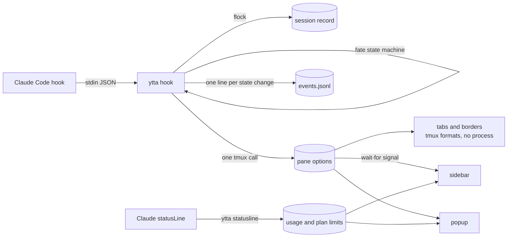
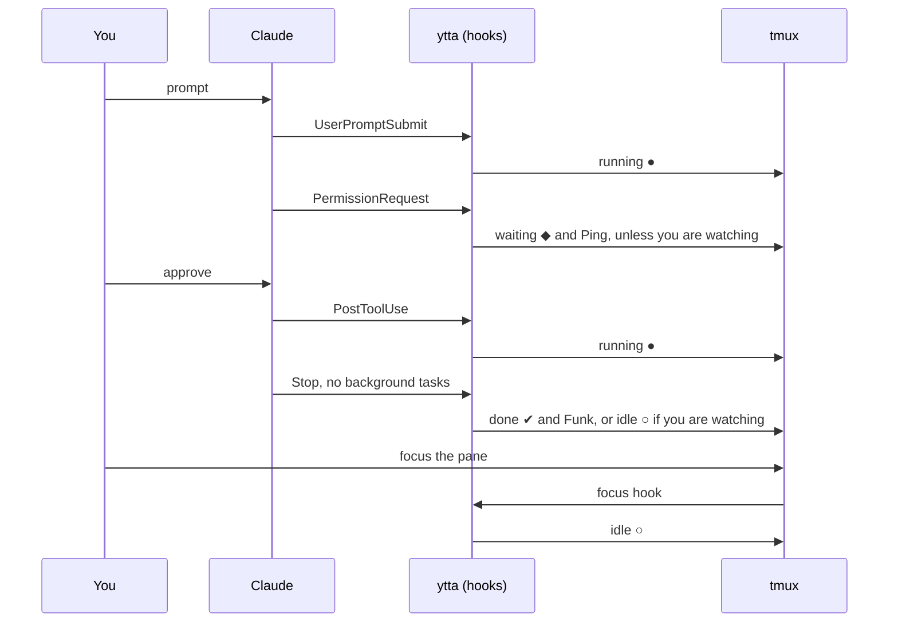
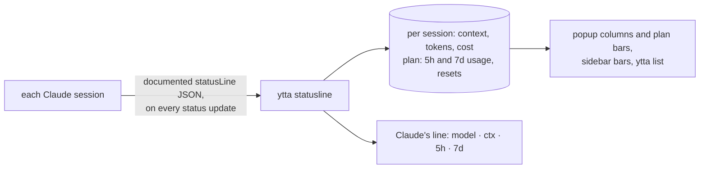
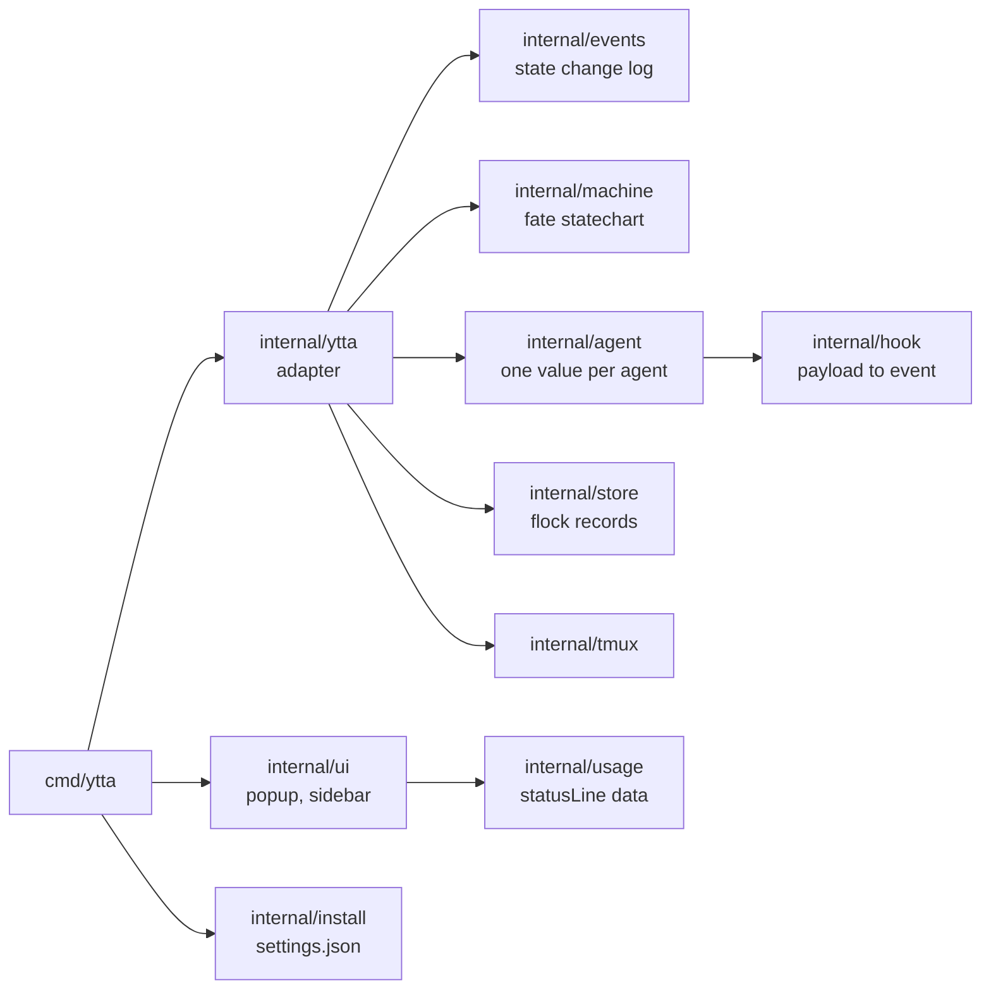

<h1 align="center">
  <picture>
    <source media="(prefers-color-scheme: dark)" srcset="https://raw.githubusercontent.com/arisros/ytta/main/docs/img/logo-lockup-dark.svg">
    
  </picture>
</h1>

<p align="center"><b>your tmux terminal agent 😉</b>. An agent control plane for tmux: see which coding agents need you and why, answer them from where you are, and script them. Claude Code, Codex, Gemini CLI, opencode, Copilot CLI, Droid, Qwen Code, Kilo Code, Pi, Kimi Code and Hermes Agent, across every session.</p>

<p align="center">
  <a href="https://github.com/arisros/ytta/actions/workflows/ci.yml"></a>
  <a href="https://github.com/arisros/ytta/releases"></a>
  <a href="go.mod"></a>
  
  <a href="LICENSE"></a>
</p>


<sub>Two agents on a side project, the sidebar on the left. The home directory path is blurred, nothing else.</sub>

## Quickstart

Needs tmux 3.2+ and Claude Code; the other agents are under [Agents](#agents). On tmux 3.2 the popup has no border style or title. Go 1.26+ is optional: without it, the plugin downloads a release binary and checks its checksum.

```tmux
# ~/.tmux.conf (or ~/.config/tmux/tmux.conf), then prefix I
set -g @plugin 'arisros/ytta'
```

```sh
ytta=~/.config/tmux/plugins/ytta/bin/ytta   # or ~/.tmux/plugins/...
$ytta install --claude            # preview the change to ~/.claude/settings.json
$ytta install --claude --apply    # write it, with a backup
$ytta doctor                      # every line should be ✔
```

Show state in your tabs and pane borders by adding the formats where you like:

```tmux
set -g window-status-format         ' #I:#W#{E:@ytta_window_icon} '
set -g window-status-current-format ' #I:#W#{E:@ytta_window_icon} '
set -g pane-border-format           ' #{pane_title}#{E:@ytta_pane_icon} '
```

`prefix a` opens the popup, `prefix e` the sidebar.

## What it shows

| State | Glyph | Means | Clears when |
|---|---|---|---|
| waiting | ◆ white on red | Claude needs you, and ytta says for what: `permission Bash`, `question`, `elicitation`, or `dialog` when only the screen showed it | you answer it |
| done | ✔ blue | the turn finished while you were looking elsewhere | you look at the pane |
| running | ● green, pulsing ● ◉ ◎ ◉ | working, including background tasks Claude will resume from | the turn ends |
| idle | ○ grey | at the prompt, and you have seen it | you send a prompt |

| Where | What |
|---|---|
| **Popup** `prefix a` | every agent in every session, most urgent first, with context used, tokens, cost, and your plan's 5-hour and 7-day usage; below the list, the agent under the cursor: how long its session has run, its last state changes, and its screen, so you can read a dialog and answer it from here |
| **Sidebar** `prefix e` | this session's agents in a pane that follows you across windows, plus a one-line count of the other sessions |
| **Tabs and borders** | the icon of the most urgent agent in each window, and of each agent pane |
| **Sounds** | Ping when an agent starts waiting, Funk when it finishes, only for panes you are not looking at |

## Why

| Problem | What ytta does |
|---|---|
| Tab colors set by hooks never clear, so yellow means "asked once", not "blocked now" | a state machine with an explicit way out of every state |
| Agent dashboards that replace tmux mean a second multiplexer and a new keymap | a tmux plugin: your panes, keys and layouts stay as they are |
| Status plugins that poll every pane stall a busy server | event-driven: nothing runs between events, and a hook makes at most one tmux call |
| Hooks alone miss Esc and denied permissions (no event fires) | the screen is checked for Claude's own end markers when you leave the pane |

Measured on a private tmux server with 11 sessions, 64 windows and 120 panes (`make perf`, Apple M4):

| Path | p50 | p95 |
|---|---|---|
| hook with no state change (every tool call) | 4.7 ms | 6.4 ms |
| hook that changes state (a few per turn) | 11.9 ms | 15.7 ms |
| view refresh | 14.7 ms | 15.9 ms |
| state machine restore, send, persist | 12 µs | |

## How it works



One turn, from ytta's point of view:



The full machine, generated from the code: [docs/state-machine.md](docs/state-machine.md). Its transitions come from sequences recorded in real sessions ([test/fixtures](test/fixtures)), not only from the hook documentation. Some of what the recordings showed:

| Situation | Hooks | What ytta does |
|---|---|---|
| Esc during a turn, or a denied permission | none fire | when you leave the pane or open a view, reads the line above Claude's input box: `Interrupted` or `· done 4:12` means idle |
| a long command after you approved it | nothing until it ends | a waiting agent with no dialog on screen goes back to running |
| background tasks or subagents still running at `Stop` | `Stop` reports them | stays running; Claude resumes by itself when they finish |
| a turn Claude resumed after background work | no `Stop` at all | `idle_prompt` ends it |
| an agent already open when you installed the plugin | none until its next prompt or tool | followed on its screen at every view refresh, then hooks take over |
| a plan or permission prompt in a narrow pane | the question wraps, and the plan prompt has no `Esc to cancel` | the selected choice, `❯ 1. Yes`, marks the dialog |
| an agent that crashed or was killed | none | each hook remembers the pane's foreground command; once it changes, the agent is hidden at once and forgotten when a view opens |

The screen is only trusted for Claude's explicit markers (its dialogs, the spinner line, `esc to interrupt`, `Interrupted`, `· done`). A footer that merely looks quiet proves nothing: Claude hides `esc to interrupt` while a tool runs in auto mode.

## Keys

| Key | Popup | Sidebar (focus it first) |
|---|---|---|
| `j` `k`, arrows, wheel | move | move; the wheel scrolls even when unfocused |
| `g` `G` | top, bottom | top, bottom |
| `/` | filter | filter |
| `a` | only the agents that need you (waiting, done) | the same |
| Enter, `l`, →, click on an agent | jump to the agent, across sessions | jump to the agent; a click works even when unfocused |
| `p`, text, Enter | send a prompt to the agent | the same |
| `1` to `9` | press that key in a waiting agent's dialog, while its screen is shown | |
| `i` then `y` | interrupt the agent's turn (Esc) | the same |
| `s` | mark a done agent as seen | the same |
| `y` | copy the agent's last 2000 lines to the tmux paste buffer and the clipboard | the same |
| `r`, name, Enter | label the agent; an empty name gives it back its own title | the same |
| `x` then `y` | kill the agent's pane | kill the agent's pane |
| `q`, Esc | close | close the sidebar |

A filter is words that must all match somewhere in the row, or `field:word` for one field: `state:waiting`, `reason:permission`, `agent:codex`, `session:work`, `branch:feat`, `path:`, `name:`, `window:`, `pane:`. Among waiting and done agents the one kept waiting longest comes first. The branch is read from the repository's own files, so no `git` process runs.

`ytta list --json --filter 'state:waiting'` prints the same rows for scripts: `pane`, `target`, `state`, `reason`, `agent`, `name`, `path`, `branch`, `session_id`, `started_at`, `age_seconds` and `usage`.

A script can drive an agent with the same pieces, and none of them polls: they sleep inside tmux until a hook fires.

```sh
pane=%12
ytta send "$pane" "run the migration tests and fix what fails"
case "$(ytta wait --timeout 30m "$pane")" in
waiting) ytta list --json --filter "pane:$pane" | jq -r '.[0].reason' ;;  # it needs an answer
done|idle) echo finished ;;
esac
ytta events --follow --json | jq -r 'select(.to == "waiting") | .pane'   # every agent that starts waiting
```

ytta only types into a pane whose agent is still running: tmux checks that in the same call that sends, so a pane that fell back to a shell never receives a prompt as a command. The same actions work from a script with `ytta send <pane> <text>`, `ytta interrupt <pane>` and `ytta rename <pane> <name>`.

The sidebar keeps its place as the full-height left column: it follows you to other windows, comes back after `swap-pane`, `rotate-window` or a layout change, restores its width when squeezed, and leaves a window once it is the only pane left.

## Agents

| Agent | Install | Reported by hooks | Read from the screen | Usage and plan bars |
|---|---|---|---|---|
| Claude Code | `ytta install --claude --apply` | everything but Esc and a denied permission | those two endings, and dialogs | yes, from its statusLine |
| Codex CLI 0.124+ | `ytta install --codex --apply`, then `/hooks` in Codex to trust them | prompts, tools, permission requests, the end of a turn; a closed session from 0.145, Esc from 0.150 | dialogs and work in progress | no: Codex only writes them to its transcript, which ytta does not read |
| Gemini CLI | `ytta install --gemini --apply`, then restart it | prompts, tools, permission prompts, the end of a turn | nothing | no |
| opencode | `ytta install --opencode --apply`, then restart it | prompts, tools, permission requests and their answers, questions, an aborted turn, the end of a turn | nothing | tokens and cost, counted from when opencode started; no context or plan bars |
| Copilot CLI | `ytta install --copilot --apply`, then restart it | prompts, tools, permission prompts, elicitations, the end of a turn, a closed session | nothing | no |
| Droid | `ytta install --droid --apply`, then restart it | prompts, tools, permission prompts, elicitations, a cancelled turn, the end of a turn, a closed session | nothing | no |
| Qwen Code | `ytta install --qwen --apply`, then restart it | prompts, tools, permission requests, the end of a turn and one an error ended, a closed session | nothing | no |
| Kilo Code CLI | `ytta install --kilo --apply`, then restart it | what opencode reports: it carries opencode's plugin interface | nothing | tokens and cost, as for opencode |
| Pi | `ytta install --pi --apply`, then `/reload` in it | prompts, tools, the end of a turn, a closed or switched session | nothing | no |
| Kimi Code CLI | `ytta install --kimi --apply`, then restart it | prompts, tools, permission requests and their answers, Esc, the end of a turn and one an error ended, a closed session | nothing | no |
| Hermes Agent | `ytta install --hermes --apply`, then restart it and accept the hooks | turns, tools, approval requests and their answers, the end of a turn (interrupted or not), a closed session | nothing | no |

Only Claude Code's transitions are replayed from recorded sessions. The others are built from each project's published hook or plugin interface and tested against that, so treat them as experimental until recordings exist:

- **Codex**: a denied approval may show as running until your next prompt.
- **Gemini CLI**: its hooks may not see `TMUX_PANE` when its environment redaction is on; allow that variable in its settings if no agent shows up.
- **Copilot CLI**: ytta writes its own `ytta.json` into `~/.copilot/hooks/`, beside any hooks files of yours. Nothing reports a denied permission or Esc, so either may show as waiting or running until the turn ends.
- **Droid**: its hooks do not tell a sub-droid's tool calls from the main one's, and nothing reports a denied permission until the turn ends.
- **Qwen Code**: nothing reports Esc or a denied permission, so either may show as running or waiting until your next prompt.
- **Kilo Code CLI**: the opencode plugin, written to `~/.config/kilo/plugin/`. What is said of opencode below holds for it.
- **Pi**: ytta writes an extension file into `~/.pi/agent/extensions/`. Pi asks no permissions, so it never shows as waiting; a prompt an extension of yours puts up is not reported.
- **Kimi Code CLI**: ytta appends its `[[hooks]]` tables to `~/.kimi-code/config.toml` between two comment lines, and removes exactly those. A config that defines `hooks` as an inline array is refused.
- **Hermes Agent**: ytta appends a `hooks:` key to `~/.hermes/config.yaml` between two comment lines. A config that already has one is refused, with the line to add by hand. Hermes asks for consent once per hook.
- **Continue CLI**: `cn` reads Claude Code's settings, so the hooks `ytta install --claude` wrote already report it, shown as Claude. It has no install target of its own, which would fire every event twice.
- **opencode**: ytta writes a plugin file into `~/.config/opencode/plugins/` that runs `ytta hook` for each event. It reports an opencode started in a tmux pane, not one reached with `opencode attach`. Closing opencode sends no event; the agent is forgotten when its pane changes.

Each hook remembers the pane's foreground command, so an agent started through a wrapper (Codex from npm runs as `node`) is tracked and forgotten like any other.

## Usage and plan limits

`ytta install --claude` also sets Claude Code's `statusLine` to `ytta statusline`, unless you have a status line of your own. To keep yours and still feed ytta, add `--wrap-statusline`: Claude then runs ytta, which records the numbers and prints whatever your command prints. `ytta uninstall` puts your command back exactly.



ytta reads no transcript files (their format is internal to Claude Code) and calls no API. The cost is Claude Code's own estimate; on a subscription, the 5-hour and 7-day percentages are the numbers that matter.

## Options

Set them before tpm loads the plugin.

| Option | Default | |
|---|---|---|
| `@ytta-popup-key` | `a` | popup key (prefix table) |
| `@ytta-sidebar-key` | `e` | sidebar toggle |
| `@ytta-sidebar-width` | `34` | sidebar width in columns |
| `@ytta-popup-attention` | `off` | open the popup on the agents that need you (waiting, done); `a` shows the rest |
| `@ytta-sidebar-pin` | `on` | put the sidebar back after swaps and layout changes |
| `@ytta-tab-pulse` | `off` | pulse running agents in tabs and borders on any terminal: one `ytta tick` per second while an agent runs, and `status-interval 1` (restored when turned off). Terminals that render blinking text pulse without it. |
| `@ytta-sound` | `on` | sounds for panes you are not watching |
| `@ytta-sound-command` | `afplay` (macOS), `paplay` (Linux) | player |
| `@ytta-sound-waiting` | Ping.aiff, bell.oga | |
| `@ytta-sound-done` | Funk.aiff, complete.oga | |
| `@ytta-notify-command` | unset | a command run when an agent starts waiting or finishes, for panes you are not watching. It gets the state, the pane id and the reason: `waiting %12 permission Bash`, `done %12` |

### Notifications

The notify command runs inside tmux, next to the sound, so it costs no extra process until it fires. Only the state, the pane id and the reason are passed; ask tmux for anything else.

```sh
#!/bin/sh
# ~/.config/tmux/ytta-notify.sh: $1 state, $2 pane, $3 and $4 the reason
where=$(tmux display-message -p -t "$2" '#{session_name}:#{window_index} #{pane_title}')
case "$(uname)" in
Darwin) osascript -e 'on run argv' -e 'display notification (item 2 of argv) with title (item 1 of argv)' -e 'end run' "agent $1 $3 $4" "$where" ;;
*) notify-send "agent $1 $3 $4" "$where" ;;
esac
```

```tmux
set -g @ytta-notify-command '~/.config/tmux/ytta-notify.sh'
```

Anything that takes arguments works the same way: a webhook with `curl`, a chat message, a log line.

## Troubleshooting

| Symptom | Look at |
|---|---|
| anything | `ytta doctor` checks tmux, focus events, keys, hooks, statusLine, the sound player, stale agents and the binary |
| a state looks wrong | `ytta events` lists every state change with what caused it (a hook, the screen, your focus); `--pane %12` narrows it, `--json` prints lines. It logs the stored state, so a turn you watched end reads `done` where the pane shows idle. `~/.local/state/ytta/views.log` adds the screen line a check relied on, and why a view closed |
| the plugin did not load | `bin/install.log` and `bin/init.log` in the plugin directory |
| old hook scripts color tabs or play sounds | remove them from `~/.claude/settings.json`; `ytta doctor` flags tab coloring |
| remove everything | `ytta uninstall --claude --apply`, then the `@plugin` line |

If the plugin is removed without uninstalling, its hooks become no-ops rather than errors.

## Development

```sh
make test    # unit, fixture replay, and integration tests on private tmux servers
make perf    # the 120-pane test and the state machine benchmark, run alone
make lint
make build   # bin/ytta, stamped with git describe
```



Integration tests start their own `tmux -L ytta-test-*` servers and never touch the server you work in. Fixtures are recorded with `ytta install --claude --record`, cut with `scripts/fixture-from-record.sh`, and checked by a leak scanner that also reads private words from `YTTA_LEAK_WORDS`. See [CONTRIBUTING.md](CONTRIBUTING.md).

## Roadmap

- [x] hook-driven state machine, with repairs for silent endings
- [x] popup across sessions, sidebar per session, tab and border icons
- [x] token usage and plan limits from the statusLine
- [x] release binaries with a checksummed download in the tpm entrypoint
- [x] why an agent is waiting, and a log of state changes
- [x] agents that exited are cleared, and a stricter `ytta doctor`
- [x] a command to run when an agent needs you
- [x] tmux 3.2, tested in CI next to 3.3
- [x] Codex, Gemini CLI and opencode
- [x] Copilot CLI, Droid, Qwen Code, Kilo Code CLI, Pi, Kimi Code CLI and Hermes Agent, from their documentation
- [x] a preview you can answer from, `ytta send`, `ytta wait`, `ytta events --follow`
- [ ] recorded sessions for Codex, Gemini CLI, opencode, Copilot CLI, Droid, Qwen Code, Kilo Code CLI, Pi, Kimi Code CLI and Hermes Agent, to replace what was read from their documentation
- [ ] recordings of the Claude Code cases still missing: resume, compaction, a crash, a failed tool, an elicitation

What is left, the rules every change keeps, what was declined and why, and the non-goals: [docs/roadmap.md](docs/roadmap.md).

## Prior art

- **[herdr](https://herdr.dev)** is a terminal workspace built for coding agents, with an agent panel and state detection. Use it if you want a multiplexer made around agents; ytta exists for people who want to stay in tmux.
- **[tmux-handlr](https://github.com/CRThaze/tmux-handlr)** brings herdr's detection rules to tmux as status dots, a menu, a dashboard and a sidebar, reading each pane's screen.
- **[tmux-agent-pulse](https://github.com/jerriclynsjohn/tmux-agent-pulse)** is hook-driven like ytta and supports Codex too, with a popup and a sidebar.

ytta started after trying both plugins on a large server. It differs in being event-driven end to end, keeping one sidebar per session, and repairing the endings no hook reports.

MIT. See [LICENSE](LICENSE).
